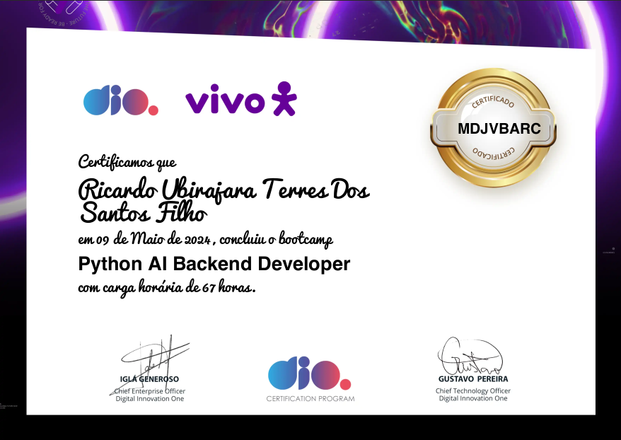

# Dio.me - Python AI Backend Developer 

Seja bem vind@ ao repositório onde se encontram os projetos desenvolvidos durante o evento da DIO, Python AI Backend Developer.

O bootcamp foi focado no desenvolvimento backend, ensinando sobre funções de Python com estrutura de dados, conceitos importantes de orientação a objetos (POO), SQL e NoSQL, além de ensinar a integrar esses conhecimentos ao framework Fast API para aprofundar o desenvolvimento web construindo APIs a partir da metodologia de testes unitários com TDD (Test-Driven Development).

Para finalizar, o curso apresenta os pilares da Inteligência Artificial, Machine Learning, visão computacional e processamento de linguagem natural, mostrando como utilizar estas ferramentas para nos auxiliar no dia a dia.

## Modulos

* [Dominando Python e Suas Estruturas de Dados](/python_estruturas_dados/): Explore técnicas para otimizar seu código e torná-lo mais eficiente.
* [Orientação a Objetos e Boas Práticas em Python](/python_orientacao_objetos/): Escreva código Python limpo, organizado e fácil de manter.
* [Bancos de Dados SQL e NoSQL Para Devs Backend](/python_banco_dados_db_api/): Aprenda os fundamentos de bancos de dados relacionais e não relacionais.
* [Explorando o FastAPI na Prática com TDD](/python_fast_api_tdd/): Implemente o desenvolvimento orientado a testes (TDD) para garantir a qualidade do seu código.

## Certificado

  

